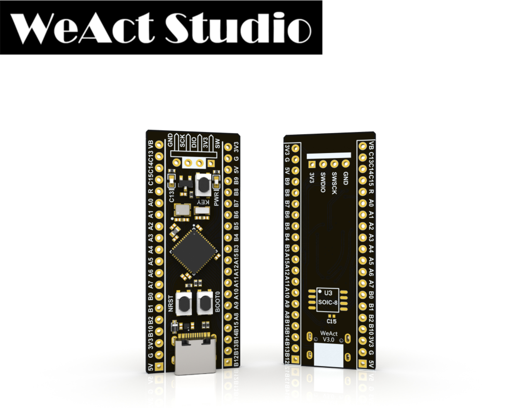

## WeAct STM32F411CEU6 (aka. BlackPill) Board Definition for MicroPython

### Build the Firmware
* Install the dependencies
* Clone the official MicroPython repo
* Build cross compiler
* Create a folder under `ports/stm32/boards/`, e.g. `ports/stm32/boards/WEACT_STM32F411CE`
* Copy the definition files to the above folder
* Back to path `ports/stm32`
* Build the firmware with command `make BOARD=WEACT_STM32F411CE`
* See [here](https://github.com/micropython/micropython/wiki/Getting-Started)
and [here](https://github.com/micropython/micropython/wiki/Building-Micropython-Binaries)

### Flash the Firmware

* Install [STM32CubeProgrammer](https://www.st.com/zh/development-tools/stm32cubeprog.html)
* Connect the USB cable.
* Keep pressing both the `NRST` & `BOOT0` buttons on the board.
* Release the `NRST` button first, then release `BOOT0` shortly after (in about 0.5s).
  * In case the device cannot be recognized, disconnect the USB cable, then cover the oscillators and the MCU with the thumb to warm them up for a while, and try again.
* Click refresh button on the right panel of the STM32CubeProgrammer.
* Select the port from the dropdown menu and click 'Connect'.
* Click 'Open file' tab to select the `firmware.hex`.
* Click 'Download' to flash the firmware, wait until it finishes.
* Press `NRST` button on the board to reset.

---

### Exposed Port Pins

* PA0-PA15
* PB0-PB10, PB12-PB15
* PC13-PC15

### Peripherals

#### BLUE LED - _low active_

* LED: PC13

#### User Button

* PA0

#### SPI Flash W25Q64 (8MB) - _enabled in this definition_

* F_CS: PA4
* F_SCK: PA5
* F_MISO: PA6
* F_MOSI: PA7

#### USB

* USB_DM: PA11
* USB_DP: PA12

---

### Bus Pinouts

#### UART

|       | UART1 | UART2 | UART6 |
|-------|-------|-------|-------|
|  TX   |  PA9  |  PA2  |  PA11 |
|  RX   |  PA10 |  PA3  |  PA12 |

#### I2C

|       | I2C1  |  I2C2 | I2C3  |
|-------|-------|-------|-------|
|  SCL  |  PB6  |  PB10 |  PA8  |
|  SDA  |  PB7  |  PB9  |  PB8  |

#### SPI

|       | SPI2  | SPI3  | SPI4  | SPI5  |
|-------|-------|-------|-------|-------|
|  CS   |  PB12 |  PA15 |  PB12 |  PB1  |
|  SCK  |  PB13 |  PB3  |  PB13 |  PA10 |
|  MISO |  PB14 |  PB4  |  PA1  |  PA12 |
|  MOSI |  PB15 |  PB5  |  PA11 |  PB0  |
  * _SPI1 used by external SPI Flash_

### Reference

* [MicroPython Forum Discussion: WeAct STM32F411CEU6 black pill](https://forum.micropython.org/viewtopic.php?f=12&t=7154)
* [WeActTC / MiniF4-STM32F4x1](https://github.com/WeActTC/MiniF4-STM32F4x1/tree/master/SDK/STM32F411CEU6/MicroPython/WeAct_F411CE)
* [https://github.com/mcauser/WEACT_F411CEU6](https://github.com/mcauser/WEACT_F411CEU6)
* [https://github.com/YXZhu/micropython/tree/master/ports/stm32/boards/WeAct_F411CE](https://github.com/YXZhu/micropython/tree/master/ports/stm32/boards/WeAct_F411CE)
* [https://github.com/jugnu-jethi/WeAct_F411CE-MicroPython/tree/myFix_FirstTimeBuild](https://github.com/jugnu-jethi/WeAct_F411CE-MicroPython/tree/myFix_FirstTimeBuild)
